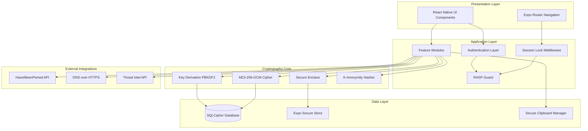
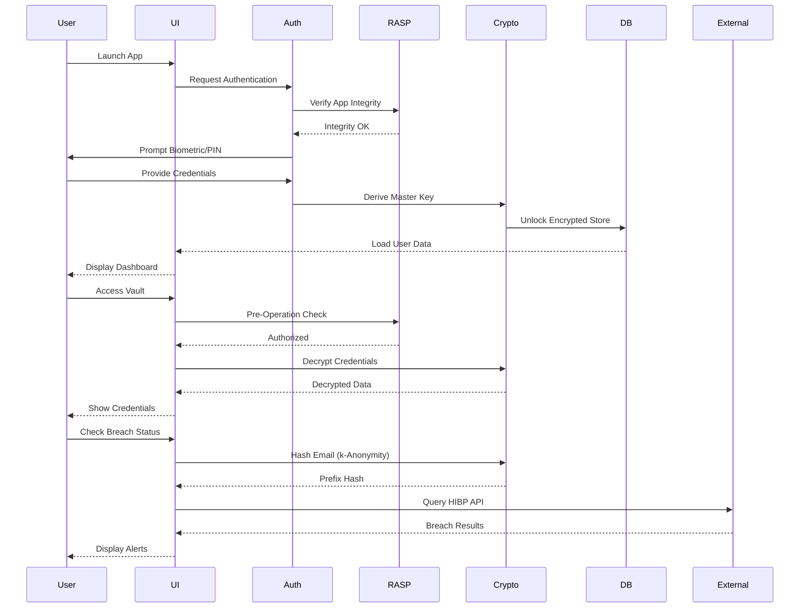
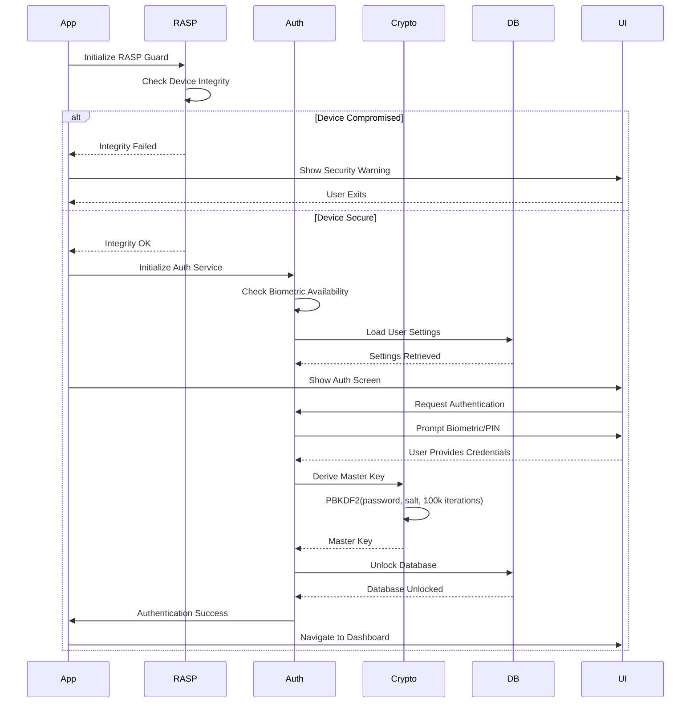
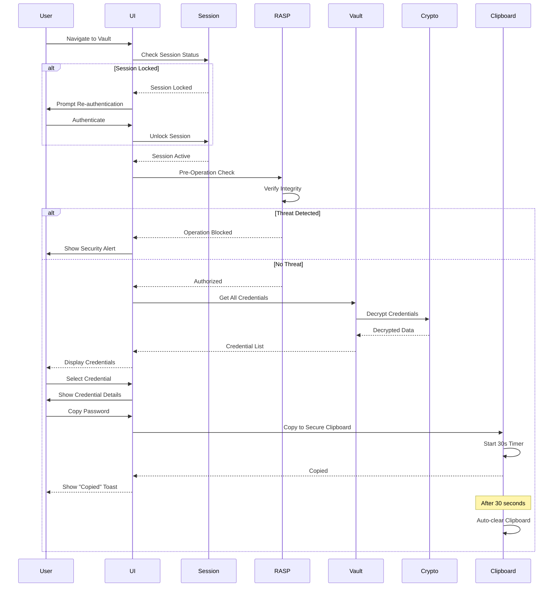
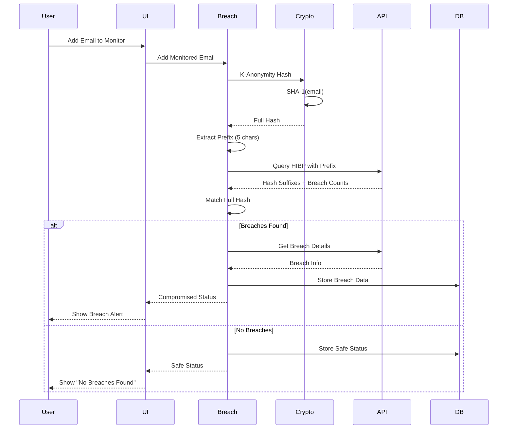
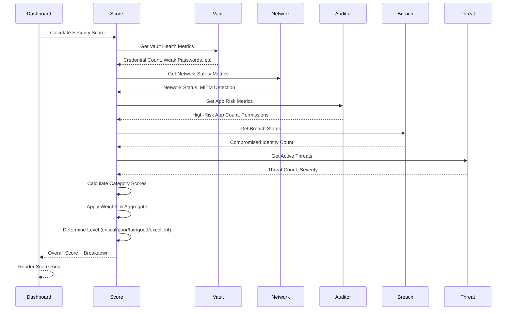
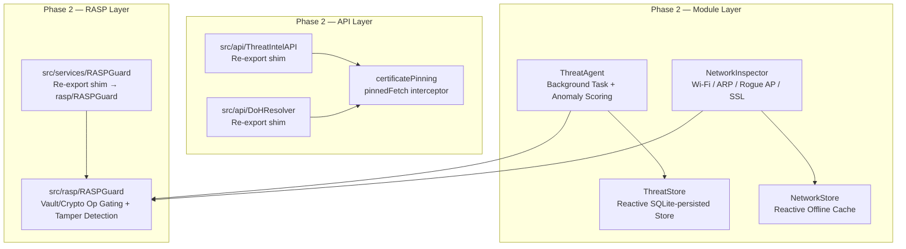

# Design Document: Aegis Personal Cybersecurity Companion

## Overview

Aegis is a privacy-first, on-device personal cybersecurity mobile application for iOS and Android built with React Native (Expo SDK) and TypeScript. The application consolidates six defensive security modules into a unified interface: Encrypted Credential Vault, Real-Time Threat Monitor, Network Safety Analyzer, Breach Alert Engine, App Permission Auditor, and Security Score Dashboard. The architecture follows a zero-trust model where all sensitive operations occur on-device with AES-256-GCM encryption, biometric authentication, and runtime application self-protection (RASP). The system is designed to OWASP MASVS Level 2 compliance standards, ensuring no personally identifiable information (PII) leaves the device unencrypted.

## Architecture

The application follows a layered architecture pattern with clear separation of concerns:



### System Flow



## Components and Interfaces

### Component 1: Authentication Layer

**Purpose**: Manages user authentication using biometric (Face ID/Touch ID/Fingerprint) with PIN fallback, session management, and auto-lock functionality.

**Interface**:
```typescript
interface IAuthenticationService {
  // Authenticate user with biometric or PIN
  authenticate(): Promise<AuthResult>;
  
  // Verify biometric availability
  isBiometricAvailable(): Promise<BiometricCapability>;
  
  // Set up PIN as fallback
  setupPIN(pin: string): Promise<void>;
  
  // Verify PIN
  verifyPIN(pin: string): Promise<boolean>;
  
  // Lock session
  lockSession(): void;
  
  // Check if session is active
  isSessionActive(): boolean;
  
  // Get failed attempt count
  getFailedAttempts(): number;
  
  // Reset failed attempts
  resetFailedAttempts(): void;
}

interface AuthResult {
  success: boolean;
  method: 'biometric' | 'pin';
  error?: AuthError;
}

interface BiometricCapability {
  available: boolean;
  type: 'faceId' | 'touchId' | 'fingerprint' | 'none';
}

type AuthError = 
  | 'biometric_unavailable'
  | 'biometric_failed'
  | 'pin_incorrect'
  | 'account_locked'
  | 'unknown';
```

**Responsibilities**:
- Manage biometric authentication flow
- Handle PIN-based authentication as fallback
- Implement escalating lockout (3 attempts → 30s, 5 attempts → 5min, 10 attempts → permanent)
- Track session state and auto-lock after 60s idle
- Integrate with expo-local-authentication and expo-secure-store

---

### Component 2: Cryptography Core

**Purpose**: Provides encryption, decryption, key derivation, and cryptographic hashing services using AES-256-GCM and PBKDF2.

**Interface**:
```typescript
interface ICryptographyService {
  // Derive master key from user password/PIN
  deriveMasterKey(password: string, salt: Uint8Array): Promise<CryptoKey>;
  
  // Encrypt data with AES-256-GCM
  encrypt(data: string, key: CryptoKey): Promise<EncryptedData>;
  
  // Decrypt data with AES-256-GCM
  decrypt(encryptedData: EncryptedData, key: CryptoKey): Promise<string>;
  
  // Generate random salt
  generateSalt(): Uint8Array;
  
  // Generate random IV for AES-GCM
  generateIV(): Uint8Array;
  
  // Hash data with SHA-256
  hash(data: string): Promise<string>;
  
  // K-anonymity hash for breach checking
  kAnonymityHash(email: string): Promise<KAnonymityResult>;
}

interface EncryptedData {
  ciphertext: string; // Base64 encoded
  iv: string; // Base64 encoded initialization vector
  authTag: string; // Base64 encoded authentication tag
}

interface KAnonymityResult {
  prefix: string; // First 5 characters of SHA-1 hash
  fullHash: string; // Complete SHA-1 hash
}

interface CryptoKey {
  key: Uint8Array;
  algorithm: 'AES-GCM';
  keySize: 256;
}
```

**Responsibilities**:
- Implement PBKDF2 key derivation with 100,000 iterations
- Provide AES-256-GCM encryption/decryption with authenticated encryption
- Generate cryptographically secure random values for salts and IVs
- Implement k-anonymity hashing for privacy-preserving breach checks
- Integrate with expo-crypto and react-native-quick-crypto

---

### Component 3: Encrypted Credential Vault (F1)

**Purpose**: Securely stores and manages passwords, passkeys, 2FA TOTP seeds, and API keys with AES-256-GCM encryption.

**Interface**:
```typescript
interface IVaultService {
  // Add new credential
  addCredential(credential: Credential): Promise<string>;
  
  // Get credential by ID
  getCredential(id: string): Promise<Credential | null>;
  
  // Get all credentials
  getAllCredentials(): Promise<Credential[]>;
  
  // Update credential
  updateCredential(id: string, updates: Partial<Credential>): Promise<void>;
  
  // Delete credential
  deleteCredential(id: string): Promise<void>;
  
  // Search credentials
  searchCredentials(query: string): Promise<Credential[]>;
  
  // Generate TOTP code
  generateTOTP(totpSeed: string): Promise<TOTPCode>;
  
  // Copy to secure clipboard
  copyToClipboard(value: string): Promise<void>;
}

interface Credential {
  id: string;
  type: 'password' | 'passkey' | 'totp' | 'apiKey';
  title: string;
  username?: string;
  password?: string;
  passkey?: string;
  totpSeed?: string;
  apiKey?: string;
  url?: string;
  notes?: string;
  tags: string[];
  createdAt: number;
  updatedAt: number;
  lastUsed?: number;
}

interface TOTPCode {
  code: string;
  remainingSeconds: number;
}
```

**Responsibilities**:
- Encrypt all credential data before storage using master key
- Decrypt credentials on-demand for display
- Generate time-based one-time passwords (TOTP) using RFC 6238
- Manage secure clipboard with 30-second auto-purge
- Support credential search and filtering
- Track credential usage statistics

---

### Component 4: Real-Time Threat Monitor (F2)

**Purpose**: Passive background monitoring for over-privileged app activity, suspicious data exfiltration, and rootkit/jailbreak indicators.

**Interface**:
```typescript
interface IThreatMonitorService {
  // Start background monitoring
  startMonitoring(): Promise<void>;
  
  // Stop background monitoring
  stopMonitoring(): void;
  
  // Get current threat level
  getThreatLevel(): ThreatLevel;
  
  // Get active threats
  getActiveThreats(): Threat[];
  
  // Check for rootkit/jailbreak
  checkDeviceIntegrity(): Promise<IntegrityResult>;
  
  // Monitor app behavior
  monitorAppActivity(appId: string): Promise<ActivityReport>;
}

interface Threat {
  id: string;
  type: 'privilege_escalation' | 'data_exfiltration' | 'rootkit' | 'jailbreak' | 'suspicious_network';
  severity: 'low' | 'medium' | 'high' | 'critical';
  description: string;
  detectedAt: number;
  appId?: string;
  resolved: boolean;
}

interface IntegrityResult {
  isCompromised: boolean;
  indicators: string[];
  riskScore: number;
}

interface ActivityReport {
  appId: string;
  suspiciousActions: string[];
  networkCalls: number;
  dataAccessed: string[];
  riskScore: number;
}

type ThreatLevel = 'safe' | 'advisory' | 'warning' | 'critical';
```

**Responsibilities**:
- Monitor system for rootkit/jailbreak indicators
- Track app permission usage patterns
- Detect unusual network activity
- Generate threat alerts with severity levels
- Maintain threat history log

---

### Component 5: Network Safety Analyzer (F3)

**Purpose**: Identifies unsecured Wi-Fi networks, detects MITM attack vectors, and routes DNS through DNS-over-HTTPS (DoH).

**Interface**:
```typescript
interface INetworkService {
  // Get current network status
  getNetworkStatus(): Promise<NetworkStatus>;
  
  // Check if network is secure
  isNetworkSecure(): Promise<boolean>;
  
  // Detect MITM indicators
  detectMITM(): Promise<MITMResult>;
  
  // Configure DNS-over-HTTPS
  configureDNSOverHTTPS(provider: DoHProvider): Promise<void>;
  
  // Get DNS resolution status
  getDNSStatus(): Promise<DNSStatus>;
  
  // Scan for network threats
  scanNetwork(): Promise<NetworkScanResult>;
}

interface NetworkStatus {
  connected: boolean;
  type: 'wifi' | 'cellular' | 'ethernet' | 'none';
  ssid?: string;
  isSecure: boolean;
  encryption?: 'WPA3' | 'WPA2' | 'WPA' | 'WEP' | 'none';
  signalStrength?: number;
  ipAddress?: string;
}

interface MITMResult {
  detected: boolean;
  indicators: string[];
  riskLevel: 'low' | 'medium' | 'high';
}

interface DNSStatus {
  enabled: boolean;
  provider: DoHProvider;
  latency: number;
}

interface NetworkScanResult {
  threats: NetworkThreat[];
  recommendations: string[];
  overallRisk: number;
}

interface NetworkThreat {
  type: 'unsecured_wifi' | 'mitm' | 'dns_hijack' | 'arp_spoofing';
  severity: 'low' | 'medium' | 'high';
  description: string;
}

type DoHProvider = 'cloudflare' | 'google' | 'quad9';
```

**Responsibilities**:
- Monitor Wi-Fi connection security status
- Detect man-in-the-middle attack indicators
- Configure and manage DNS-over-HTTPS routing
- Provide network security recommendations
- Track network security metrics

---

### Component 6: Breach Alert Engine (F4)

**Purpose**: Monitors email addresses and usernames against the HaveIBeenPwned API using k-anonymity hashing to preserve privacy.

**Interface**:
```typescript
interface IBreachService {
  // Check email for breaches
  checkEmail(email: string): Promise<BreachResult>;
  
  // Check username for breaches
  checkUsername(username: string): Promise<BreachResult>;
  
  // Add email to monitoring list
  addMonitoredEmail(email: string): Promise<void>;
  
  // Remove email from monitoring
  removeMonitoredEmail(email: string): Promise<void>;
  
  // Get all monitored identities
  getMonitoredIdentities(): Promise<MonitoredIdentity[]>;
  
  // Refresh breach data
  refreshBreachData(): Promise<void>;
}

interface BreachResult {
  compromised: boolean;
  breaches: BreachInfo[];
  totalBreaches: number;
  lastChecked: number;
}

interface BreachInfo {
  name: string;
  title: string;
  domain: string;
  breachDate: string;
  addedDate: string;
  pwnCount: number;
  dataClasses: string[];
  isVerified: boolean;
  isSensitive: boolean;
}

interface MonitoredIdentity {
  id: string;
  type: 'email' | 'username';
  value: string;
  lastChecked: number;
  breachCount: number;
  status: 'safe' | 'compromised';
}
```

**Responsibilities**:
- Implement k-anonymity hashing (first 5 chars of SHA-1) for privacy
- Query HaveIBeenPwned API without exposing full email/username
- Maintain list of monitored identities
- Generate breach alerts when new breaches detected
- Store breach history locally

---

### Component 7: App Permission Auditor (F5)

**Purpose**: Enumerates installed applications and their permissions, assigns risk scores based on permission usage patterns.

**Interface**:
```typescript
interface IPermissionAuditorService {
  // Get all installed apps
  getInstalledApps(): Promise<InstalledApp[]>;
  
  // Get app permissions
  getAppPermissions(appId: string): Promise<AppPermission[]>;
  
  // Calculate app risk score
  calculateRiskScore(appId: string): Promise<number>;
  
  // Get high-risk apps
  getHighRiskApps(): Promise<InstalledApp[]>;
  
  // Audit all apps
  auditAllApps(): Promise<AuditReport>;
}

interface InstalledApp {
  id: string;
  name: string;
  packageName: string;
  version: string;
  installedDate: number;
  permissions: AppPermission[];
  riskScore: number;
  riskLevel: 'low' | 'medium' | 'high' | 'critical';
}

interface AppPermission {
  name: string;
  granted: boolean;
  dangerous: boolean;
  category: PermissionCategory;
}

type PermissionCategory = 
  | 'location'
  | 'camera'
  | 'microphone'
  | 'contacts'
  | 'storage'
  | 'phone'
  | 'sms'
  | 'calendar'
  | 'sensors'
  | 'network';

interface AuditReport {
  totalApps: number;
  highRiskApps: number;
  totalPermissions: number;
  dangerousPermissions: number;
  recommendations: string[];
  overallRisk: number;
}
```

**Responsibilities**:
- Enumerate installed applications on device
- Extract and categorize app permissions
- Calculate risk scores based on permission combinations
- Identify over-privileged applications
- Generate permission audit reports

---

### Component 8: Security Score Dashboard (F6)

**Purpose**: Calculates and displays dynamic security posture score (0-100) based on vault health, network status, app risk, and OS hygiene.

**Interface**:
```typescript
interface ISecurityScoreService {
  // Calculate overall security score
  calculateSecurityScore(): Promise<SecurityScore>;
  
  // Get score breakdown by category
  getScoreBreakdown(): Promise<ScoreBreakdown>;
  
  // Get security recommendations
  getRecommendations(): Promise<Recommendation[]>;
  
  // Get score history
  getScoreHistory(days: number): Promise<ScoreHistoryEntry[]>;
}

interface SecurityScore {
  overall: number; // 0-100
  level: 'critical' | 'poor' | 'fair' | 'good' | 'excellent';
  lastUpdated: number;
}

interface ScoreBreakdown {
  vaultHealth: CategoryScore;
  networkSafety: CategoryScore;
  appRisk: CategoryScore;
  osHygiene: CategoryScore;
  breachStatus: CategoryScore;
}

interface CategoryScore {
  score: number; // 0-100
  weight: number; // Contribution to overall score
  status: 'critical' | 'warning' | 'good';
  issues: string[];
}

interface Recommendation {
  id: string;
  priority: 'low' | 'medium' | 'high' | 'critical';
  category: string;
  title: string;
  description: string;
  action: string;
  impact: number; // Score improvement if addressed
}

interface ScoreHistoryEntry {
  timestamp: number;
  score: number;
  level: string;
}
```

**Responsibilities**:
- Aggregate security metrics from all modules
- Calculate weighted security score (0-100)
- Generate actionable security recommendations
- Track score history over time
- Provide score breakdown by category

---

### Component 9: RASP Guard

**Purpose**: Runtime Application Self-Protection to detect tampering, debugging, and integrity violations before sensitive operations.

**Interface**:
```typescript
interface IRASPGuard {
  // Initialize RASP checks
  initialize(): Promise<void>;
  
  // Verify app integrity
  verifyIntegrity(): Promise<IntegrityCheckResult>;
  
  // Check for debugger
  isDebuggerAttached(): boolean;
  
  // Check for emulator
  isRunningOnEmulator(): boolean;
  
  // Check for root/jailbreak
  isDeviceCompromised(): Promise<boolean>;
  
  // Verify code signature
  verifyCodeSignature(): Promise<boolean>;
  
  // Pre-operation security check
  preOperationCheck(): Promise<RASPResult>;
}

interface IntegrityCheckResult {
  passed: boolean;
  violations: string[];
  timestamp: number;
}

interface RASPResult {
  allowed: boolean;
  reason?: string;
  threatLevel: 'none' | 'low' | 'medium' | 'high';
}
```

**Responsibilities**:
- Detect debugger attachment
- Identify emulator/simulator environments
- Check for root/jailbreak status
- Verify app code signature integrity
- Block operations when threats detected
- Log security violations

---

### Component 10: Session Lock Middleware

**Purpose**: Enforces automatic session locking after 60 seconds of inactivity and requires re-authentication.

**Interface**:
```typescript
interface ISessionLockService {
  // Start session timer
  startSession(): void;
  
  // Reset inactivity timer
  resetTimer(): void;
  
  // Lock session
  lockSession(): void;
  
  // Check if session is locked
  isLocked(): boolean;
  
  // Get time until auto-lock
  getTimeUntilLock(): number;
  
  // Configure auto-lock timeout
  setAutoLockTimeout(seconds: number): void;
}
```

**Responsibilities**:
- Track user activity and inactivity periods
- Automatically lock session after 60s idle
- Require re-authentication after lock
- Provide session state to UI components
- Clear sensitive data from memory on lock

---

### Component 11: Secure Clipboard Manager

**Purpose**: Singleton service managing clipboard operations with automatic 30-second purge of sensitive data.

**Interface**:
```typescript
interface ISecureClipboardService {
  // Copy sensitive data to clipboard
  copy(value: string, type: ClipboardDataType): Promise<void>;
  
  // Get clipboard content
  paste(): Promise<string | null>;
  
  // Clear clipboard
  clear(): void;
  
  // Check if clipboard has content
  hasContent(): boolean;
  
  // Get time until auto-clear
  getTimeUntilClear(): number;
}

type ClipboardDataType = 'password' | 'apiKey' | 'totp' | 'generic';
```

**Responsibilities**:
- Copy sensitive data to system clipboard
- Start 30-second auto-purge timer
- Clear clipboard automatically after timeout
- Notify user of clipboard operations
- Prevent clipboard data leakage

---

### Component 12: Data Layer (SQLCipher Database)

**Purpose**: Encrypted local database using expo-sqlite with SQLCipher for persistent storage of all user data.

**Interface**:
```typescript
interface IDatabaseService {
  // Initialize database
  initialize(masterKey: CryptoKey): Promise<void>;
  
  // Execute query
  execute(query: string, params?: unknown[]): Promise<QueryResult>;
  
  // Insert record
  insert(table: string, data: Record<string, unknown>): Promise<number>;
  
  // Update record
  update(table: string, id: number, data: Record<string, unknown>): Promise<void>;
  
  // Delete record
  delete(table: string, id: number): Promise<void>;
  
  // Select records
  select<T>(query: string, params?: unknown[]): Promise<T[]>;
  
  // Begin transaction
  beginTransaction(): Promise<void>;
  
  // Commit transaction
  commit(): Promise<void>;
  
  // Rollback transaction
  rollback(): Promise<void>;
  
  // Close database
  close(): Promise<void>;
}

interface QueryResult {
  rowsAffected: number;
  insertId?: number;
}
```

**Responsibilities**:
- Manage SQLCipher encrypted database
- Provide CRUD operations for all tables
- Support transactions for atomic operations
- Handle database migrations
- Ensure data encryption at rest

## Data Models

### Credential Model

```typescript
interface Credential {
  id: string; // UUID
  type: 'password' | 'passkey' | 'totp' | 'apiKey';
  title: string; // Max 100 chars
  username?: string; // Max 255 chars
  password?: string; // Encrypted, max 1000 chars
  passkey?: string; // Encrypted, max 2000 chars
  totpSeed?: string; // Encrypted, base32 encoded
  apiKey?: string; // Encrypted, max 500 chars
  url?: string; // Max 500 chars
  notes?: string; // Encrypted, max 5000 chars
  tags: string[]; // Max 10 tags, 50 chars each
  createdAt: number; // Unix timestamp
  updatedAt: number; // Unix timestamp
  lastUsed?: number; // Unix timestamp
  favorite: boolean;
  icon?: string; // URL or base64 encoded image
}
```

**Validation Rules**:
- `id` must be valid UUID v4
- `type` must be one of the enum values
- `title` is required and non-empty
- At least one of `password`, `passkey`, `totpSeed`, or `apiKey` must be present
- `url` must be valid URL if provided
- `tags` array max length 10
- All encrypted fields stored as base64 strings

**Database Schema**:
```sql
CREATE TABLE credentials (
  id TEXT PRIMARY KEY,
  type TEXT NOT NULL CHECK(type IN ('password', 'passkey', 'totp', 'apiKey')),
  title TEXT NOT NULL,
  username TEXT,
  password TEXT, -- Encrypted
  passkey TEXT, -- Encrypted
  totp_seed TEXT, -- Encrypted
  api_key TEXT, -- Encrypted
  url TEXT,
  notes TEXT, -- Encrypted
  tags TEXT, -- JSON array
  created_at INTEGER NOT NULL,
  updated_at INTEGER NOT NULL,
  last_used INTEGER,
  favorite INTEGER DEFAULT 0,
  icon TEXT
);

CREATE INDEX idx_credentials_type ON credentials(type);
CREATE INDEX idx_credentials_title ON credentials(title);
CREATE INDEX idx_credentials_favorite ON credentials(favorite);
```

---

### Threat Model

```typescript
interface Threat {
  id: string; // UUID
  type: 'privilege_escalation' | 'data_exfiltration' | 'rootkit' | 'jailbreak' | 'suspicious_network';
  severity: 'low' | 'medium' | 'high' | 'critical';
  description: string; // Max 500 chars
  detectedAt: number; // Unix timestamp
  appId?: string; // Package name
  appName?: string;
  resolved: boolean;
  resolvedAt?: number; // Unix timestamp
  metadata: Record<string, unknown>; // JSON object
}
```

**Validation Rules**:
- `id` must be valid UUID v4
- `type` must be one of the enum values
- `severity` must be one of the enum values
- `description` is required and non-empty
- `detectedAt` must be valid timestamp
- `resolved` defaults to false
- `metadata` stored as JSON string

**Database Schema**:
```sql
CREATE TABLE threats (
  id TEXT PRIMARY KEY,
  type TEXT NOT NULL,
  severity TEXT NOT NULL,
  description TEXT NOT NULL,
  detected_at INTEGER NOT NULL,
  app_id TEXT,
  app_name TEXT,
  resolved INTEGER DEFAULT 0,
  resolved_at INTEGER,
  metadata TEXT -- JSON
);

CREATE INDEX idx_threats_severity ON threats(severity);
CREATE INDEX idx_threats_resolved ON threats(resolved);
CREATE INDEX idx_threats_detected_at ON threats(detected_at DESC);
```

---

### Monitored Identity Model

```typescript
interface MonitoredIdentity {
  id: string; // UUID
  type: 'email' | 'username';
  value: string; // Max 255 chars
  addedAt: number; // Unix timestamp
  lastChecked: number; // Unix timestamp
  breachCount: number;
  status: 'safe' | 'compromised';
  breaches: BreachInfo[]; // Stored as JSON
}
```

**Validation Rules**:
- `id` must be valid UUID v4
- `type` must be 'email' or 'username'
- `value` must be valid email if type is 'email'
- `value` is required and non-empty
- `breachCount` must be non-negative integer
- `breaches` stored as JSON array

**Database Schema**:
```sql
CREATE TABLE monitored_identities (
  id TEXT PRIMARY KEY,
  type TEXT NOT NULL CHECK(type IN ('email', 'username')),
  value TEXT NOT NULL UNIQUE,
  added_at INTEGER NOT NULL,
  last_checked INTEGER NOT NULL,
  breach_count INTEGER DEFAULT 0,
  status TEXT NOT NULL CHECK(status IN ('safe', 'compromised')),
  breaches TEXT -- JSON array
);

CREATE INDEX idx_monitored_identities_status ON monitored_identities(status);
CREATE INDEX idx_monitored_identities_last_checked ON monitored_identities(last_checked);
```

---

### Security Score Model

```typescript
interface SecurityScoreRecord {
  id: number; // Auto-increment
  timestamp: number; // Unix timestamp
  overallScore: number; // 0-100
  level: 'critical' | 'poor' | 'fair' | 'good' | 'excellent';
  vaultHealthScore: number; // 0-100
  networkSafetyScore: number; // 0-100
  appRiskScore: number; // 0-100
  osHygieneScore: number; // 0-100
  breachStatusScore: number; // 0-100
  breakdown: ScoreBreakdown; // Stored as JSON
}
```

**Validation Rules**:
- All score fields must be 0-100
- `level` must be one of the enum values
- `timestamp` must be valid Unix timestamp
- `breakdown` stored as JSON string

**Database Schema**:
```sql
CREATE TABLE security_scores (
  id INTEGER PRIMARY KEY AUTOINCREMENT,
  timestamp INTEGER NOT NULL,
  overall_score INTEGER NOT NULL CHECK(overall_score >= 0 AND overall_score <= 100),
  level TEXT NOT NULL,
  vault_health_score INTEGER NOT NULL,
  network_safety_score INTEGER NOT NULL,
  app_risk_score INTEGER NOT NULL,
  os_hygiene_score INTEGER NOT NULL,
  breach_status_score INTEGER NOT NULL,
  breakdown TEXT -- JSON
);

CREATE INDEX idx_security_scores_timestamp ON security_scores(timestamp DESC);
```

---

### User Settings Model

```typescript
interface UserSettings {
  id: number; // Always 1 (singleton)
  masterKeySalt: string; // Base64 encoded, 32 bytes
  pinHash?: string; // SHA-256 hash of PIN
  biometricEnabled: boolean;
  autoLockTimeout: number; // Seconds, default 60
  clipboardTimeout: number; // Seconds, default 30
  dohProvider: DoHProvider;
  dohEnabled: boolean;
  breachCheckInterval: number; // Hours, default 24
  threatMonitoringEnabled: boolean;
  lastBackupAt?: number; // Unix timestamp
  createdAt: number; // Unix timestamp
  updatedAt: number; // Unix timestamp
}
```

**Validation Rules**:
- `id` always 1 (singleton pattern)
- `masterKeySalt` must be 32 bytes base64 encoded
- `autoLockTimeout` must be 30-300 seconds
- `clipboardTimeout` must be 10-60 seconds
- `breachCheckInterval` must be 1-168 hours

**Database Schema**:
```sql
CREATE TABLE user_settings (
  id INTEGER PRIMARY KEY CHECK(id = 1),
  master_key_salt TEXT NOT NULL,
  pin_hash TEXT,
  biometric_enabled INTEGER DEFAULT 1,
  auto_lock_timeout INTEGER DEFAULT 60,
  clipboard_timeout INTEGER DEFAULT 30,
  doh_provider TEXT DEFAULT 'cloudflare',
  doh_enabled INTEGER DEFAULT 1,
  breach_check_interval INTEGER DEFAULT 24,
  threat_monitoring_enabled INTEGER DEFAULT 1,
  last_backup_at INTEGER,
  created_at INTEGER NOT NULL,
  updated_at INTEGER NOT NULL
);
```

## Main Algorithm/Workflow

### Application Initialization Flow



### Credential Vault Access Flow



### Breach Check Flow



### Security Score Calculation Flow


src/
├── app/
│   ├── (tabs)/
│   │   ├── index.tsx          # Dashboard screen
│   │   ├── vault.tsx          # Vault screen
│   │   ├── network.tsx        # Network screen
│   │   ├── alerts.tsx         # Alerts screen
│   │   └── audit.tsx          # Audit screen
│   ├── auth.tsx               # Auth screen
│   └── _layout.tsx            # Root layout
├── components/
│   ├── ScoreRing.tsx
│   ├── ModuleHealthBar.tsx
│   ├── CredentialCard.tsx
│   ├── AlertItem.tsx
│   ├── AppRiskCard.tsx
│   └── SecurityBadge.tsx
├── services/
│   ├── AuthService.ts
│   ├── CryptoService.ts
│   ├── VaultService.ts
│   ├── ThreatMonitorService.ts
│   ├── NetworkService.ts
│   ├── BreachService.ts
│   ├── PermissionAuditorService.ts
│   ├── SecurityScoreService.ts
│   ├── RASPGuard.ts
│   ├── SessionLockService.ts
│   ├── SecureClipboardService.ts
│   └── api/
│       ├── BreachAPI.ts
│       ├── ThreatIntelAPI.ts
│       └── DoHResolver.ts
├── database/
│   └── DatabaseService.ts
├── theme/
│   └── colors.ts
└── types/
    └── index.ts
```

## UI/UX Design Language

Aegis uses a flat, minimal, information-dense design language optimized for security data at a glance. The visual system is built around semantic color coding that communicates threat level instantly without requiring the user to read text.

**Core Principles**:
- Dark background to reduce eye strain during sensitive operations
- Semantic color = status (no ambiguity)
- Monospace font for all sensitive data (passwords, keys, hashes) to aid readability and copying
- High contrast ratios for accessibility
- Minimal chrome — content over decoration

**Semantic Color Coding**:

| Status | Color | Hex | Usage |
|--------|-------|-----|-------|
| Safe / Secure | Green | `#00FF88` | Score ≥ 80, no threats, secure network |
| Warning / Advisory | Amber | `#FFB800` | Score 50–79, minor issues, weak passwords |
| Critical / Danger | Red | `#FF3B30` | Score < 50, active threats, breaches detected |
| Neutral / Inactive | Gray | `#8E8E93` | Disabled states, secondary text |

**Typography**:
- UI text: System font (SF Pro on iOS, Roboto on Android)
- Sensitive data display: `SpaceMono` or `Courier New` monospace
- Score numbers: Bold, large, colored by status

**Background Hierarchy**:
- App background: `#0A0A0F` (near-black)
- Card/surface: `#12121A`
- Elevated surface: `#1C1C28`
- Border/divider: `#2A2A3A`

## Theme and Color System

**File**: `src/theme/colors.ts`

```typescript
export const colors = {
  // Semantic status colors
  safe: '#00FF88',       // Green — secure/healthy
  warning: '#FFB800',    // Amber — advisory/caution
  danger: '#FF3B30',     // Red — critical/breach
  neutral: '#8E8E93',    // Gray — inactive/secondary

  // Background hierarchy
  background: '#0A0A0F',
  surface: '#12121A',
  surfaceElevated: '#1C1C28',
  border: '#2A2A3A',

  // Text hierarchy
  textPrimary: '#FFFFFF',
  textSecondary: '#8E8E93',
  textMuted: '#4A4A5A',
  textMonospace: '#E0E0E0', // For passwords, keys, hashes

  // Status indicator mapping (threat level → color)
  statusColors: {
    safe: '#00FF88',
    advisory: '#FFB800',
    warning: '#FFB800',
    critical: '#FF3B30',
    good: '#00FF88',
    poor: '#FF3B30',
    fair: '#FFB800',
    excellent: '#00FF88',
  } as Record<string, string>,

  // Score ring gradient stops
  scoreGradient: {
    high: ['#00FF88', '#00CC66'],    // 80–100
    medium: ['#FFB800', '#FF8C00'],  // 50–79
    low: ['#FF3B30', '#CC2020'],     // 0–49
  },

  // Interactive states
  primary: '#5B5BFF',
  primaryPressed: '#4444DD',
  destructive: '#FF3B30',
  success: '#00FF88',
} as const;

export type ColorKey = keyof typeof colors;
```

## UI Components

### ScoreRing

**File**: `src/components/ScoreRing.tsx`

Animated circular progress ring displaying the overall security score (0–100). Color transitions based on score threshold.

```typescript
interface ScoreRingProps {
  score: number;           // 0–100
  size?: number;           // Diameter in px, default 160
  strokeWidth?: number;    // Ring thickness, default 12
  animated?: boolean;      // Animate on mount, default true
  label?: string;          // Center label below score, e.g. "Security Score"
}
```

**Behavior**:
- Score 80–100 → ring color `colors.safe` (`#00FF88`)
- Score 50–79 → ring color `colors.warning` (`#FFB800`)
- Score 0–49 → ring color `colors.danger` (`#FF3B30`)
- On mount, animates from 0 to current score over 800ms using `react-native-reanimated`
- Score number displayed in center, bold, colored to match ring
- Background ring track uses `colors.border`

---

### ModuleHealthBar

**File**: `src/components/ModuleHealthBar.tsx`

Horizontal progress bar for a single security module category score with label and score value.

```typescript
interface ModuleHealthBarProps {
  label: string;           // e.g. "Vault Health", "Network Safety"
  score: number;           // 0–100
  weight?: number;         // Optional weight percentage display
  onPress?: () => void;    // Navigate to module screen
}
```

**Behavior**:
- Bar fill color follows same threshold logic as ScoreRing (green/amber/red)
- Score value displayed right-aligned as `{score}/100`
- Tappable — navigates to the relevant module screen if `onPress` provided
- Bar background uses `colors.border`

---

### CredentialCard

**File**: `src/components/CredentialCard.tsx`

List item card for a vault credential entry.

```typescript
interface CredentialCardProps {
  credential: Credential;
  onPress: (id: string) => void;       // Open detail view
  onCopy: (value: string) => void;     // Copy password/key to clipboard
  onLongPress?: (id: string) => void;  // Show context menu (edit/delete)
}
```

**Behavior**:
- Left: type icon (lock for password, key for API key, shield for passkey, clock for TOTP)
- Center: `title` (primary text) + `username` (secondary text, truncated)
- Right: copy icon button — calls `onCopy` with the relevant secret value
- TOTP type shows live countdown ring (30s cycle) next to copy button
- Password value never displayed in list — only copy action available
- Background: `colors.surface`, border: `colors.border`

---

### AlertItem

**File**: `src/components/AlertItem.tsx`

List item for a threat or breach alert with severity color coding.

```typescript
interface AlertItemProps {
  alert: Threat | BreachInfo;
  onDismiss: (id: string) => void;
  onPress: (id: string) => void;       // Open alert detail
}
```

**Behavior**:
- Left accent bar color matches severity: `critical` → red, `high` → red, `medium` → amber, `low` → neutral
- Alert type icon (shield-x for threat, database-x for breach)
- Title + short description, timestamp right-aligned
- Swipe-left or dismiss button to mark resolved
- Resolved alerts shown with reduced opacity (`0.4`)

---

### AppRiskCard

**File**: `src/components/AppRiskCard.tsx`

Card showing an installed app's permission risk assessment.

```typescript
interface AppRiskCardProps {
  app: InstalledApp;
  onPress: (appId: string) => void;    // Open permission detail
}
```

**Behavior**:
- App icon (if available) + app name + package name (secondary, monospace)
- Right: `SecurityBadge` showing risk level
- Below name: permission count summary, e.g. "12 permissions · 4 dangerous"
- Tapping opens a detail sheet listing all permissions with dangerous ones highlighted in amber/red

---

### SecurityBadge

**File**: `src/components/SecurityBadge.tsx`

Small inline pill badge indicating a safe/warning/critical status.

```typescript
interface SecurityBadgeProps {
  status: 'safe' | 'warning' | 'critical';
  label?: string;   // Override default label (defaults to status string)
  size?: 'sm' | 'md';
}
```

**Behavior**:
- `safe` → green background tint + `#00FF88` text, label "SAFE"
- `warning` → amber background tint + `#FFB800` text, label "WARNING"
- `critical` → red background tint + `#FF3B30` text, label "CRITICAL"
- Background is 15% opacity of the status color on `colors.surface`
- All caps, monospace font, rounded pill shape

## Screen Specifications

### Dashboard — `src/app/(tabs)/index.tsx`

**Layout**:
- Top: `ScoreRing` (size 160) centered with overall score + level label
- Below ring: 5 `ModuleHealthBar` components (Vault Health, Network Safety, App Risk, OS Hygiene, Breach Status)
- Section: "Recent Alerts" — last 3 `AlertItem` components, "View All" link to Alerts tab
- Bottom: Quick action row — "Scan Network", "Check Breaches", "Add Credential" buttons

**Key Interactions**:
- Tapping `ScoreRing` expands score breakdown sheet
- Tapping a `ModuleHealthBar` navigates to that module's tab
- Pull-to-refresh recalculates security score
- Score animates on every refresh

---

### Vault — `src/app/(tabs)/vault.tsx`

**Layout**:
- Top: Search bar (filters credential list in real-time)
- Filter chips: All / Passwords / Passkeys / TOTP / API Keys
- Body: `FlatList` of `CredentialCard` components
- FAB (bottom-right): "+" to add new credential

**Key Interactions**:
- Search filters by title, username, URL, tags
- Filter chips toggle credential type filter
- Tapping a card opens credential detail sheet (full decrypt on demand)
- Long-press card shows edit/delete context menu
- Copy action triggers `SecureClipboardService` + toast notification with countdown
- FAB opens add credential form (type selector → fields)

---

### Network — `src/app/(tabs)/network.tsx`

**Layout**:
- Top card: Current network status (SSID, encryption type, `SecurityBadge` for overall status)
- MITM Detection card: Status indicator + last scan timestamp + "Scan Now" button
- DNS-over-HTTPS card: Toggle switch + provider selector (Cloudflare / Google / Quad9) + latency display
- Threats section: List of active `NetworkThreat` items if any

**Key Interactions**:
- "Scan Now" triggers `NetworkService.scanNetwork()` with loading state
- DoH toggle enables/disables DNS-over-HTTPS routing
- Provider selector updates `DoHResolver` configuration
- Network status auto-refreshes every 30 seconds

---

### Alerts — `src/app/(tabs)/alerts.tsx`

**Layout**:
- Tab bar: "Breaches" | "Threats" (segmented control)
- Breaches tab: List of `AlertItem` for breach alerts, grouped by monitored identity
- Threats tab: List of `AlertItem` for threat detections, sorted by severity then timestamp
- Empty state: Green checkmark + "All Clear" message when no active alerts

**Key Interactions**:
- Swipe-left on `AlertItem` to dismiss/mark resolved
- Tapping alert opens detail sheet with full breach/threat info
- "Mark All Resolved" button in header
- Breaches tab shows "Add Email to Monitor" button when list is empty

---

### Audit — `src/app/(tabs)/audit.tsx`

**Layout**:
- Top: Summary card — total apps, high-risk count, overall audit `SecurityBadge`
- Sort control: By Risk (default) / By Name / By Install Date
- Body: `FlatList` of `AppRiskCard` components
- Bottom sheet (on card tap): Full permission list for selected app

**Key Interactions**:
- Sort control reorders the app list
- Tapping `AppRiskCard` opens permission detail bottom sheet
- "Re-audit" button in header triggers `PermissionAuditorService.auditAllApps()`
- High-risk apps (score ≥ 70) shown with red left border accent

## API Client Specifications

### BreachAPI

**File**: `src/services/api/BreachAPI.ts`

HaveIBeenPwned v3 API client implementing k-anonymity for privacy-preserving breach lookups.

```typescript
interface IBreachAPI {
  // Check password via k-anonymity range endpoint
  // Sends only first 5 chars of SHA-1 hash
  checkPasswordRange(sha1Prefix: string): Promise<string[]>; // Returns suffix:count lines

  // Look up breaches for an email address
  // Requires HIBP API key for v3
  getBreachesForAccount(emailHash: string): Promise<BreachInfo[]>;

  // Get all known breaches (for local caching)
  getAllBreaches(): Promise<BreachInfo[]>;
}
```

**Implementation Notes**:
- Base URL: `https://haveibeenpwned.com/api/v3`
- Password range endpoint: `GET /range/{first5HashChars}` — no API key required
- Account breach endpoint: `GET /breachedaccount/{account}` — requires `hibp-api-key` header
- Rate limiting: max 1 request/1500ms, queue excess requests
- Retry on 429 with `Retry-After` header backoff
- All requests include `User-Agent: Aegis-App/1.0`
- No full email ever sent to API — only k-anonymity prefix

**Error Handling**:
- `404` → no breaches found (not an error)
- `429` → rate limited, back off and retry
- `401` → invalid API key, surface configuration error to user
- Network errors → return cached data if available, else surface offline state

---

### ThreatIntelAPI

**File**: `src/services/api/ThreatIntelAPI.ts`

Threat intelligence feed client for IP reputation and malicious domain lookups.

```typescript
interface IThreatIntelAPI {
  // Check if an IP address is flagged as malicious
  checkIPReputation(ip: string): Promise<IPReputationResult>;

  // Check if a domain is known malicious
  checkDomain(domain: string): Promise<DomainReputationResult>;
}

interface IPReputationResult {
  ip: string;
  malicious: boolean;
  categories: string[];   // e.g. ['botnet', 'spam', 'phishing']
  confidence: number;     // 0–100
  lastReported?: string;  // ISO date
}

interface DomainReputationResult {
  domain: string;
  malicious: boolean;
  categories: string[];
  confidence: number;
}
```

**Implementation Notes**:
- Supports pluggable provider (AbuseIPDB, VirusTotal, or custom feed)
- Results cached locally for 1 hour to minimize API calls
- Lookups performed only during active network scans, not continuously
- API key stored in `expo-secure-store`, never in source code

**Error Handling**:
- Network failure → return `malicious: false` with `confidence: 0` (fail open for UX)
- Rate limit → use cached result or skip check
- Invalid response → log and return safe default

---

### DoHResolver

**File**: `src/services/api/DoHResolver.ts`

DNS-over-HTTPS resolver supporting multiple providers with automatic fallback.

```typescript
interface IDoHResolver {
  // Resolve a hostname via DoH
  resolve(hostname: string, type?: 'A' | 'AAAA' | 'MX'): Promise<DNSRecord[]>;

  // Set active DoH provider
  setProvider(provider: DoHProvider): void;

  // Get current provider config
  getProvider(): DoHProviderConfig;

  // Measure latency to all providers
  benchmarkProviders(): Promise<Record<DoHProvider, number>>;
}

interface DNSRecord {
  name: string;
  type: string;
  TTL: number;
  data: string;
}

interface DoHProviderConfig {
  name: DoHProvider;
  url: string;
  bootstrapIP: string;  // Used to avoid circular DNS dependency
}

const DOH_PROVIDERS: Record<DoHProvider, DoHProviderConfig> = {
  cloudflare: {
    name: 'cloudflare',
    url: 'https://cloudflare-dns.com/dns-query',
    bootstrapIP: '1.1.1.1',
  },
  google: {
    name: 'google',
    url: 'https://dns.google/resolve',
    bootstrapIP: '8.8.8.8',
  },
  quad9: {
    name: 'quad9',
    url: 'https://dns.quad9.net/dns-query',
    bootstrapIP: '9.9.9.9',
  },
};
```

**Implementation Notes**:
- Uses `application/dns-json` content type for JSON-based DoH queries
- Bootstrap IP used for initial connection to avoid circular DNS resolution
- Automatic fallback to next provider if primary fails within 3s
- Query results cached with TTL from DNS response
- Used by `NetworkService` to route all app DNS through DoH when enabled

**Error Handling**:
- Provider unreachable → fallback to next provider in priority order
- All providers fail → surface warning to user, fall back to system DNS
- SERVFAIL response → treat as NXDOMAIN (domain not found)


## Correctness Properties

*A property is a characteristic or behavior that should hold true across all valid executions of a system — essentially, a formal statement about what the system should do. Properties serve as the bridge between human-readable specifications and machine-verifiable correctness guarantees.*

### Property 1: Encryption Round-Trip

*For any* valid plaintext string, encrypting it with the Cryptography_Service using a given Master_Key and then decrypting the resulting ciphertext with the same key SHALL produce a value equal to the original plaintext.

**Validates: Requirements 3.4**

---

### Property 2: Unique Initialization Vectors

*For any* two encryption operations performed by the Cryptography_Service, the initialization vectors used SHALL be distinct (no two encryption calls share the same IV).

**Validates: Requirements 3.6**

---

### Property 3: K-Anonymity Prefix Correctness

*For any* input string, the k-anonymity hash prefix returned by the Cryptography_Service SHALL be exactly 5 hexadecimal characters and SHALL equal the first 5 characters of the uppercase SHA-1 hash of that input.

**Validates: Requirements 3.5, 9.1, 15.2**

---

### Property 4: Credential Storage Round-Trip

*For any* valid Credential object, adding it to the Vault_Service and then retrieving it by its assigned ID SHALL return a Credential whose decrypted fields are equal to the original input fields.

**Validates: Requirements 4.1, 4.9**

---

### Property 5: Credential UUID Uniqueness

*For any* sequence of credentials added to the Vault_Service, all assigned identifiers SHALL be valid UUID v4 strings and SHALL be mutually distinct.

**Validates: Requirements 4.2**

---

### Property 6: Credential Validation Invariant

*For any* credential object that is missing all of password, passkey, totpSeed, and apiKey, the Vault_Service SHALL reject the credential and not persist it to the database.

**Validates: Requirements 4.4**

---

### Property 7: Credential Search Correctness

*For any* non-empty search query and any vault state, every credential returned by the Vault_Service search SHALL contain the query string in at least one of: title, username, URL, or tags; and no credential that matches the query in those fields SHALL be omitted from the results.

**Validates: Requirements 4.7**

---

### Property 8: Credential Deletion Completeness

*For any* credential that has been successfully added to the Vault_Service, after deleting it by ID, attempting to retrieve that credential by the same ID SHALL return null.

**Validates: Requirements 4.8**

---

### Property 9: Threat Severity Validity

*For any* threat detected and persisted by the Threat_Monitor_Service, the severity field SHALL be one of: low, medium, high, or critical.

**Validates: Requirements 6.4**

---

### Property 10: Threat Storage Round-Trip

*For any* threat detected by the Threat_Monitor_Service, storing it and then retrieving it by its UUID SHALL return a threat record with fields equal to those at the time of detection.

**Validates: Requirements 6.5**

---

### Property 11: RASP Operation Blocking

*For any* sensitive operation requested while the RASP_Guard integrity check returns a failure result, the operation SHALL be denied and SHALL NOT execute.

**Validates: Requirements 7.5**

---

### Property 12: Insecure Network Classification

*For any* Wi-Fi network with encryption type WEP or none, the Network_Service SHALL classify the network as insecure (isSecure = false).

**Validates: Requirements 8.2**

---

### Property 13: Breach K-Anonymity Privacy

*For any* email address or username submitted to the Breach_Service for checking, the value transmitted to the HIBP API SHALL be exactly the 5-character k-anonymity prefix and SHALL NOT contain any portion of the original plaintext value beyond those 5 characters.

**Validates: Requirements 9.1, 15.2**

---

### Property 14: Monitored Identity Status Consistency

*For any* monitored identity, after a breach check completes, the identity's status SHALL be 'compromised' if and only if at least one breach was found for that identity; otherwise the status SHALL be 'safe'.

**Validates: Requirements 9.3, 9.4**

---

### Property 15: App Risk Score Range

*For any* installed application audited by the Permission_Auditor_Service, the calculated risk score SHALL be an integer between 0 and 100 inclusive.

**Validates: Requirements 10.2**

---

### Property 16: High-Risk App Classification Threshold

*For any* installed application whose risk score is 70 or above, the Permission_Auditor_Service SHALL classify it as high-risk; and for any application whose risk score is below 70, it SHALL NOT be classified as high-risk.

**Validates: Requirements 10.4**

---

### Property 17: Permission Category Coverage

*For any* application permission enumerated by the Permission_Auditor_Service, the permission SHALL be assigned to exactly one of the defined categories: location, camera, microphone, contacts, storage, phone, sms, calendar, sensors, or network.

**Validates: Requirements 10.3**

---

### Property 18: Security Score Range

*For any* invocation of the Security_Score_Service, the calculated overall score SHALL be an integer between 0 and 100 inclusive.

**Validates: Requirements 11.1**

---

### Property 19: Security Score Level Classification

*For any* overall security score, the Security_Score_Service SHALL assign the level 'good' or 'excellent' when the score is 80–100, 'fair' when the score is 50–79, and 'poor' or 'critical' when the score is 0–49; no score SHALL map to more than one level band.

**Validates: Requirements 11.2, 11.3, 11.4**

---

### Property 20: Security Score History Round-Trip

*For any* security score calculated and persisted by the Security_Score_Service, querying the score history SHALL include an entry whose overall score and timestamp match the persisted record.

**Validates: Requirements 11.5, 11.6**

---

### Property 21: ScoreRing Color Mapping

*For any* score value in 0–100, the ScoreRing component SHALL render the ring in exactly one color: #00FF88 for scores 80–100, #FFB800 for scores 50–79, and #FF3B30 for scores 0–49.

**Validates: Requirements 12.1, 12.2, 12.3**

---

### Property 22: Credential Card Secret Concealment

*For any* Credential rendered by the CredentialCard component in list view, the rendered output SHALL not contain the plaintext value of the password, passkey, totpSeed, or apiKey fields.

**Validates: Requirements 13.1**

---

### Property 23: SecurityBadge Rendering Correctness

*For any* status value ('safe', 'warning', or 'critical'), the SecurityBadge component SHALL render with the correct color (#00FF88, #FFB800, or #FF3B30 respectively) and the correct label ("SAFE", "WARNING", or "CRITICAL" respectively).

**Validates: Requirements 13.4, 13.5, 13.6**

---

### Property 24: Database Transaction Atomicity

*For any* multi-step database transaction that fails mid-execution, the Database_Service SHALL rollback all changes such that the database state after the failed transaction is identical to the state before the transaction began.

**Validates: Requirements 14.3, 14.4**

---

### Property 25: No Plaintext PII in External Requests

*For any* outgoing HTTP request made by the Application to an external API, the request URL, headers, and body SHALL not contain any plaintext email address, username, password, passkey, TOTP seed, or API key belonging to the user.

**Validates: Requirements 15.1, 15.2**

---

## Phase 2: Threat & Network Modules

Phase 2 introduces a dedicated module layer (`src/modules/`), a cert-pinned API layer (`src/api/`), an enhanced RASP guard (`src/rasp/`), and a Settings screen. The Phase 1 `src/services/` layer is unchanged — Phase 2 extends it without replacing it.

### Updated File Structure

```
src/
├── services/                         # Phase 1 (unchanged)
│   ├── RASPGuard.ts                  # Re-export shim → src/rasp/RASPGuard.ts
│   └── api/
│       ├── ThreatIntelAPI.ts         # Canonical implementation (tested)
│       └── DoHResolver.ts            # Canonical implementation (tested)
├── modules/                          # Phase 2 feature modules
│   ├── threat/
│   │   ├── ThreatAgent.ts            # Background headless task + anomaly scoring
│   │   └── ThreatStore.ts            # Reactive store → encrypted SQLite
│   └── network/
│       ├── NetworkInspector.ts       # ARP / rogue AP / SSL anomaly detection
│       └── NetworkStore.ts           # Reactive store with offline cache
├── api/                              # Phase 2 re-export shims
│   ├── certificatePinning.ts         # pinnedFetch interceptor
│   ├── ThreatIntelAPI.ts             # Re-exports from services/api/
│   └── DoHResolver.ts                # Re-exports from services/api/
└── rasp/                             # Phase 2 enhanced RASP guard
    └── RASPGuard.ts                  # Vault/crypto gating + tamper detection
```

### Architecture Additions



---

### Component 13: ThreatAgent

**File**: `src/modules/threat/ThreatAgent.ts`

**Purpose**: Background headless task and rule-based anomaly scoring engine. All processing is on-device — no telemetry leaves the device.

**Interface**:
```typescript
interface IThreatAgent {
  registerBackgroundTask(): void;
  runAnomalyScoring(): Promise<number>; // Returns 0–100, RASP-gated
  collectTelemetry(): Promise<DeviceTelemetry>;
}
```

**Anomaly Rules**:

| Rule ID | Trigger | Score | Threat Type | Severity |
|---|---|---|---|---|
| `device_compromise` | Root/jailbreak | 100 | rootkit | critical |
| `code_signature_invalid` | Bundle ID mismatch | 90 | privilege_escalation | high |
| `debugger_attachment` | Debugger attached (prod) | 80 | privilege_escalation | high |
| `emulator_detected` | Running on emulator | 50 | suspicious_network | medium |
| `excessive_network_activity` | >50 resource entries | 40 | data_exfiltration | medium |

**Scoring**: `max(rule contributions)` clamped to [0, 100]. Max-contribution prevents double-counting.

**Background Task**: Registered as `AEGIS_THREAT_AGENT` via `expo-task-manager`. Gracefully degrades when not installed.

---

### Component 14: ThreatStore

**File**: `src/modules/threat/ThreatStore.ts`

**Purpose**: Reactive in-memory store with write-through persistence to encrypted SQLite.

**Interface**:
```typescript
interface IThreatStore {
  getState(): ThreatStoreState;
  subscribe(fn: (state: ThreatStoreState) => void): () => void;
  hydrate(): Promise<void>;
  addThreat(threat: Omit<Threat, 'id'>): Promise<Threat>;
  resolveThreats(ids: string[]): Promise<void>;
  getActiveThreats(): Threat[];
  getAllThreats(): Threat[];
  clearResolvedThreats(): Promise<void>;
}

interface ThreatStoreState {
  threats: Threat[];
  hydrated: boolean;
  threatLevel: ThreatLevel;
}
```

**RASP gating**: `addThreat` and `resolveThreats` call `raspGuard.preOperationCheck()` before any write.

---

### Component 15: NetworkInspector

**File**: `src/modules/network/NetworkInspector.ts`

**Purpose**: Comprehensive network security assessment extending `NetworkService`.

**Interface**:
```typescript
interface INetworkInspector {
  inspect(): Promise<NetworkInspectionReport>; // RASP-gated, persists to NetworkStore
  assessWiFi(): Promise<WiFiAssessment | null>;
  detectARPSpoofing(): Promise<ARPSpoofingResult>;
  fingerprintRogueAP(): Promise<RogueAPResult>;
  detectSSLAnomalies(): Promise<SSLAnomalyResult>;
}
```

**Detection Capabilities**:

| Check | Method | Indicators |
|---|---|---|
| Wi-Fi encryption | NetInfo + heuristic | WEP/none → insecure; WPA → advisory |
| ARP spoofing | Gateway probe + redirect check | Unexpected redirect host |
| Rogue AP | BSSID/SSID/signal/frequency | Null BSSID; short SSID; signal >-30 dBm; open 2.4 GHz |
| SSL anomaly | Multi-endpoint HTTPS probe | Certificate error; TLS handshake failure |

---

### Component 16: NetworkStore

**File**: `src/modules/network/NetworkStore.ts`

**Purpose**: Reactive store for network security state with offline cache in encrypted SQLite.

**Interface**:
```typescript
interface INetworkStore {
  getState(): NetworkStoreState;
  subscribe(fn: (state: NetworkStoreState) => void): () => void;
  hydrate(): Promise<void>;
  updateNetworkStatus(status: NetworkStatus): Promise<void>;
  updateMITMResult(result: MITMResult): Promise<void>;
  updateLastScan(report: NetworkInspectionReport): Promise<void>;
  setScanning(scanning: boolean): void;
  setOffline(isOffline: boolean): void;
  clearCache(): Promise<void>;
}
```

**Offline cache**: `INSERT OR REPLACE` upsert into `network_cache (key, value, updated_at)`.

---

### Component 17: Certificate Pinning

**File**: `src/api/certificatePinning.ts`

**Pinned Hosts**:

| Host | Subdomain match | Usage |
|---|---|---|
| `www.virustotal.com` | No | ThreatIntelAPI |
| `haveibeenpwned.com` | No | BreachAPI |
| `cloudflare-dns.com` | Yes | DoH Cloudflare |
| `dns.google` | No | DoH Google |
| `dns.quad9.net` | No | DoH Quad9 |

**Validation layers**:
1. HTTPS-only — all HTTP requests rejected unconditionally
2. Host allowlist — requests to unpinned hosts rejected unconditionally
3. Certificate fingerprint — via `react-native-ssl-pinning` when installed; hostname-only fallback with warning

---

### Component 18: Phase 2 RASPGuard

**File**: `src/rasp/RASPGuard.ts`

**Additional interface methods** (superset of Phase 1):
```typescript
interface IRASPGuard {
  // ... all Phase 1 methods ...
  gateVaultOperation(operationName: string): Promise<void>;   // throws on failure
  gateCryptoOperation(operationName: string): Promise<void>;  // throws on failure
  detectTampering(): Promise<boolean>;                        // prototype + JSON checks
}
```

**Violation types** (superset of Phase 1):

| Violation | Threat Level |
|---|---|
| `debugger_attached` | high |
| `device_compromised` | high |
| `code_signature_invalid` | high |
| `tamper_detected` | high |
| `emulator_detected` | medium |

**Consolidation**: `src/services/RASPGuard.ts` is now a re-export shim pointing to `src/rasp/RASPGuard.ts`. All Phase 1 services automatically use the Phase 2 enhanced implementation.

---

### Component 19: Settings Screen

**File**: `src/app/(tabs)/settings.tsx`

**Purpose**: Secure API key management — keys stored in device keychain, never displayed after saving.

**Tab**: Registered in `_layout.tsx` as the 6th tab with ⚙️ gear icon.

**Supported keys**:
- `hibp_api_key` — HaveIBeenPwned API key for breach monitoring
- `threat_intel_api_key` — VirusTotal API key for threat intelligence

---

### Phase 2 Correctness Properties

### Property 26: Anomaly Score Bounds

*For any* invocation of `ThreatAgent.runAnomalyScoring()`, the returned score SHALL be an integer between 0 and 100 inclusive.

**Validates: Requirements 30.2**

---

### Property 27: ThreatStore Write-Through Consistency

*For any* threat added via `ThreatStore.addThreat()`, the threat SHALL be retrievable from both the in-memory state and the encrypted SQLite database with identical field values.

**Validates: Requirements 30.3, 32.2**

---

### Property 28: Certificate Pinning Enforcement

*For any* request made via `pinnedFetch` to a non-HTTPS URL or to a host not in the pin registry, the request SHALL be rejected before any network connection is established.

**Validates: Requirements 31.1, 31.2**

---

### Property 29: Vault Operation Gating

*For any* call to `RASPGuard.gateVaultOperation()` while `preOperationCheck()` returns a failure, the method SHALL throw an error and the vault operation SHALL NOT proceed.

**Validates: Requirements 31.3**

---

### Property 30: NetworkStore Offline Cache Consistency

*For any* network scan result persisted via `NetworkStore.updateLastScan()`, hydrating the store from the database SHALL restore a state where `lastScanResult` and `lastScanAt` match the persisted values.

**Validates: Requirements 32.1**

---

### Property 31: Rogue AP Risk Classification

*For any* access point with two or more rogue AP indicators detected by `NetworkInspector.fingerprintRogueAP()`, the returned `riskLevel` SHALL be `'high'`.

**Validates: Requirements 33.4**
